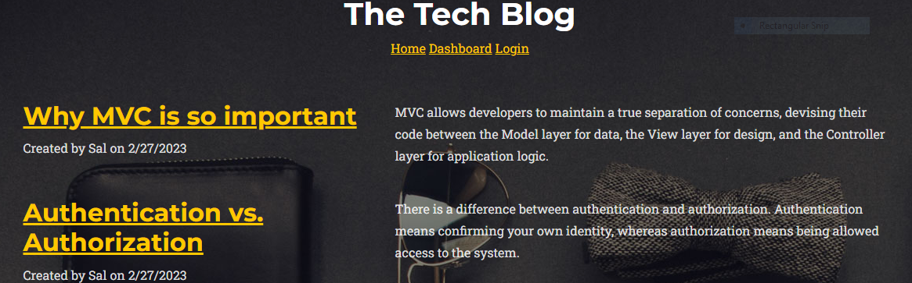

# Tech Blog

## Table of Contents
[Description](#description) 
[Usage](#usage) 
[Screenshot](#screenshot) 
[Access](#access) 
[Credits](#credits) 
[Roadmap](#roadmap) 
[Questions](#questions) 
[License](#license)

## Description
 Build a CMS-style blog site similar to a Wordpress site, where developers can publish their 
 blog posts and comment on other developers’ posts as well. 

## Usage
Dependencies need to be installed with npm i from the terminal.
MySql, HandleBars,  Sequelize
Add a .env file with: 
DB_NAME='Database Name'
DB_USER='your user name: Default: root'
DB_PASSWORD='Your Password'

## Screenshot

## Access

[Github](https://www.github.com/beattycharles)
[Tech Blog](https://git.heroku.com/whispering-taiga-51694.git)

## Credits
Special Thanks to: https://github.com/BogartDME, https://github.com/EvolanGIT, and https://github.com/difurung,
https://sequelize.org/.

## Questions
My Github is https://github.com/beattycharles,  
You can reach me at beattycharles@yahoo.com with any questions.;

## Roadmap
Bug Fixes

## License
Copyright (c) 2022 beattycharles

Permission is hereby granted, free of charge, to any person obtaining a copy
of this software and associated documentation files (the "Software"), to deal
in the Software without restriction, including without limitation the rights
to use, copy, modify, merge, publish, distribute, sublicense, and/or sell
copies of the Software, and to permit persons to whom the Software is
furnished to do so, subject to the following conditions:

The above copyright notice and this permission notice shall be included in all
copies or substantial portions of the Software.

THE SOFTWARE IS PROVIDED "AS IS", WITHOUT WARRANTY OF ANY KIND, EXPRESS OR
IMPLIED, INCLUDING BUT NOT LIMITED TO THE WARRANTIES OF MERCHANTABILITY,
FITNESS FOR A PARTICULAR PURPOSE AND NONINFRINGEMENT. IN NO EVENT SHALL THE
AUTHORS OR COPYRIGHT HOLDERS BE LIABLE FOR ANY CLAIM, DAMAGES OR OTHER
LIABILITY, WHETHER IN AN ACTION OF CONTRACT, TORT OR OTHERWISE, ARISING FROM,
OUT OF OR IN CONNECTION WITH THE SOFTWARE OR THE USE OR OTHER DEALINGS IN THE
SOFTWARE.
